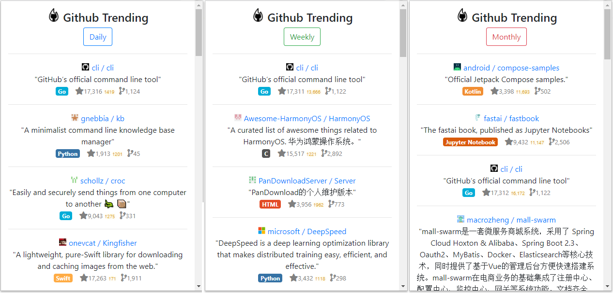

  

 

 

# Github Trending Chrome Extension

Copyright (c) 2020 Ronnie Song

This extension display the trending repositories on GitHub of the day/week/month. 

[live demo](https://ronniesong0809.github.io/github-trending-chrome-extension/)

# Install

Install Github Trending Chrome Extension from [Chrome Web Store](https://chrome.google.com/webstore/detail/github-trending/gillhpempkbfpbblallnbmmboboheehk?utm_source=GitHub&utm_medium=ronniesong0809/github-trending-chrome-extension).

# Overview

## Tech Stack and Tools
[Github Trending API](https://github.com/huchenme/github-trending-api), html, css, js, fontawesome, bootstrap

## License
This program is licensed under the "MIT License". Please see the file [`LICENSE`](https://github.com/ronniesong0809/github-trending-chrome-extension/blob/master/LICENSE) in the source distribution of this software for license terms.
